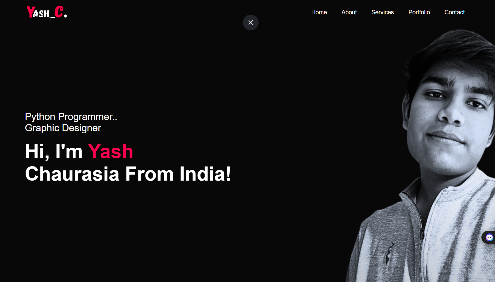
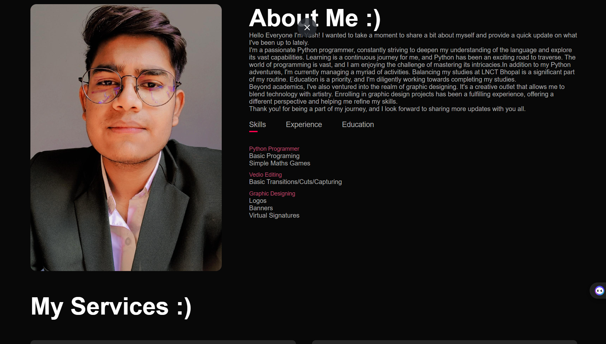

## 📂 Portfolio Website - Yash Chaurasia

Welcome to my portfolio website repository!
This project showcases my skills as a Python programmer and graphic designer.
Feel free to explore the code and provide feedback.

## 🚀 Features

- 🏠 **Home:** Introduction and brief about me.
- 📖 **About:** Details about my background, skills, and education.
- 💼 **Services:** Information on the services I offer, primarily in graphic designing.
- 🎨 **Portfolio:** A showcase of my work and projects.
- 📞 **Contact:** Ways to get in touch with me, including social media links and a contact form.

## 🛠️ Technologies Used

- HTML5
- CSS3
- JavaScript
- Font Awesome

Open `index.html` in your preferred web browser.

## 📷 Screenshots


*Home Page*


*About Page*

## 🔗Direct Link
- []([https://yash-c-portfolio.vercel.app/])
## 🤝 Contact

- 📧 Email: yashbhai9876@gmail.com

### Connect with me:

[](https://www.linkedin.com/in/yash-chaurasia-9219a3277/)
[](https://www.instagram.com/master_yash._.01/?hl=en)
[](https://t.me/Natsu_0_0)
[](https://twitter.com/master_yash_01)

Thank you for visiting my repository! 🙌
```

This README file includes a brief introduction, features, technologies used, usage instructions, screenshots, license information, and contact details with social media links. Adjust the paths for screenshots and your GitHub username as needed.
